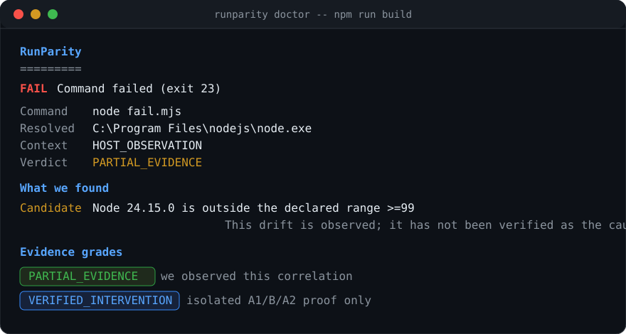
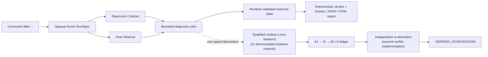

<div align="center">


**Works in CI, fails on your laptop? Stop guessing which Node, which PATH entry, which npmrc won.**

[](.github/workflows/ci.yml)
[](LICENSE)
[](#runtime-support)
[](https://www.npmjs.com/package/runparity)
[](#the-evidence-pipeline)

[Quick start](#quick-start) · [What it catches](#new-here-when-to-reach-for-runparity) · [Evidence grades](#two-words-that-keep-us-honest) · [Verified corpus](#the-evidence-pipeline) · [Why not just](#why-not-just-which-node) · [Deep dive](#deep-dive)

</div>

---

RunParity is an **evidence-first diagnosis CLI for JavaScript/TypeScript environment failures**. When a command "works on my machine" but dies somewhere else, RunParity records the command that actually ran — which executable the shell really picked (lookup path vs canonical target), which runtime identity is active versus what `engines` declares, which npm config source won, which native ABI the loader actually rejected — and then states **exactly how strong the evidence is**. It never guesses a root cause, never "repairs" your host, and never calls a correlation a proof.

---

## The one command



```console
runparity doctor -- npm run build        # observe, diagnose, grade the evidence
runparity doctor --json -- npm run build # one stable JSON document
runparity doctor --html -- npm test      # self-contained shareable HTML report
runparity doctor --attempt-proof -- npm run build   # request causal proof (see grades)
```

## Quick start

No installation or project changes required:

```console
npx --yes runparity doctor -- npm run build
```

Or install the CLI globally:

```console
npm install --global runparity
runparity doctor -- npm run build
```

To run from a source checkout instead:

```console
git clone https://github.com/zwhy149/runparity.git
cd runparity
pnpm install --frozen-lockfile
pnpm build
node dist/cli.js doctor --report-only -- node -e "process.exit(23)"
```

Deterministic offline demo included:

```console
cd examples/node-engine-drift
node ../../dist/cli.js doctor --report-only -- node fail.mjs
```

## Runtime support

The published CLI supports **Node.js 18 and newer**. The release gate executes the packed CLI on
the oldest supported runtime and runs the full verification suite on Node.js 22 and 24 across
Windows, macOS, and Linux. Contributors building from source need Node.js 22.13 or newer because
the repository pins pnpm 11.19.0.

## New here? When to reach for RunParity

| Symptom | What doctor records |
| --- | --- |
| “Works in CI, fails on my laptop” | Which executable actually ran (lookup path vs canonical target), runtime identity vs `engines.node` |
| “Broke after I switched nvm/pnpm/volta” | Runtime and package-manager drift plus PATH-order candidates |
| “My teammate's install works, mine doesn't” | npm config source conflicts (`fund`, `strict-peer-deps`) with bounded excerpts |
| `npm rebuild` did not fix a `.node` error | Genuine `NODE_MODULE_VERSION` / loader signals without rebuilding anything |
| “Just tell me if it's even fixable here” | A typed refusal instead of a wrong answer — out-of-scope failures get `REFUSED_OUT_OF_SCOPE`, not noise |

## What RunParity can inspect

| Diagnosis family | Today's evidence surface |
| --- | --- |
| **PATH_SHADOWING** | Requested command, absolute matched path, canonical `realpath` target, bounded alias→target trace (≤64), extra canonical candidates |
| **RUNTIME_MANAGER_DRIFT** | Active Node identity vs `engines.node`; recognized generic npm/pnpm Node forwarder manifests (labeled `local_manifest_claim`) |
| **CONFIG_PRECEDENCE** | Contradictory allowlisted boolean sources (`fund`, `strict-peer-deps`) across CLI / env / project `.npmrc` |
| **NATIVE_ABI_ARCH_MISMATCH** | Explicit `NODE_MODULE_VERSION` mismatch output; no downloads, no rebuilds |

Every report carries at most three ranked, bounded findings. Findings are hypotheses with stated uncertainty — never proof.

## Two words that keep us honest

<div align="center">

| Grade | Meaning | How it's earned |
| --- | --- | --- |
| 🟡 `PARTIAL_EVIDENCE` | “we observed this correlation” | Host observation alone |
| 🔵 `VERIFIED_INTERVENTION` | “an isolated experiment proved flipping exactly one typed change fixes it, and removing it breaks it again” | Three fresh A1→B→A2 sequences on a **qualified rootless backend**, re-derived by an independent verifier |

</div>

The public CLI can never print `VERIFIED_INTERVENTION` from host observation. With `--attempt-proof`, hosts without a qualified native backend answer `REFUSED_OUT_OF_SCOPE` honestly.

## The evidence pipeline



**This is not a mockup — the pipeline runs for real.** The repository ships the receipts:

<div align="center">

| Corpus state | Count | Evidence |
| --- | --- | --- |
| ✅ verified (isolated A1/B/A2 proof) | **12 supported positives** | 3-sequence ledgers × 12 cases, single-token typed interventions across 4 delta kinds |
| ✅ verified (native-host challenge) | **2 of 2** | 3× stable `REFUSED_OUT_OF_SCOPE` each on real Windows and real macOS (GitHub Actions) |
| 🔶 implemented (Host-Observe-only by design) | 2 | hard negatives — refusal, not proof, is their correct answer |
| 🧪 sealed S1 benchmark (frozen seed) | 24 cases | procedural fault-injection corpus, first-tranche results committed |

</div>

<details>
<summary><b>How a verdict actually gets earned (the receipt chain)</b></summary>

1. A dedicated QEMU-KVM Ubuntu 24.04 VM (own kernel, non-root user, rootless Podman 4.9.3) must pass an **eleven-control probe battery** — uid≠0, caps zero, `NoNewPrivs`, read-only root, write containment, network denial, credential absence, cgroup limits, detached-descendant destruction, cross-arm freshness, plus binding the nested user-namespace parent claim with host-kernel `/proc` truth. All controls must be *demonstrated*, never configured.
2. Only then may arms run under a frozen isolation policy (digest-bound): network off, caps dropped, read-only rootfs, `keep-id` non-root user, pids/memory/cpu limits, per-arm fresh writable HOME.
3. The A1/B/A2 ledger embeds bounded observations; the failure signature, frozen oracle, and the **exactly-one-token** intervention diff are recomputed by a second implementation (`fixtures/lib/evidence-verifier.mjs`) that shares no code with the runner.
4. The fixture validator re-derives every claim on every run. Self-authored receipts fail with named problems.

</details>

## Why not just `which node`?

| Manual step | What goes wrong | RunParity |
| --- | --- | --- |
| `which node` | Shows first PATH hit — aliases, shims, and symlinks hide the real binary | Lookup path **and** canonical `realpath` target, ≤64-entry alias trace, extra candidates |
| `node -v` vs `package.json` | You eyeball semver, and the running binary may not be the one you think | Observed runtime identity vs declared `engines` with a graded finding |
| `npm config list` | Wall of text; who wins and why is on you | Typed conflicts for allowlisted keys with bounded excerpts |
| Rebuild native modules | Slow, may fix nothing, hides the real ABI signal | The genuine loader error is the evidence; nothing is rebuilt |
| Post the whole log | Leaks secrets, buries the signal | Redacted-before-write captures, invocation-scoped HMAC digests, shareable HTML/JSON |

## Deep dive

<details open>
<summary><b>Safety & privacy boundary</b></summary>

`doctor` runs the command you supplied on the host with your normal permissions. It is **not a sandbox** — the target can read files, use credentials, touch the network, exactly as without RunParity. RunParity itself never edits PATH, lockfiles, global tools, or shell profiles. Captured excerpts are bounded and defense-in-depth redacted **before their first disk write**; stream digests use invocation-scoped HMAC keys that are never persisted. These controls do not guarantee a report is secret-free — review before sharing. Timeouts kill the process tree best-effort and the report says `uncontained_host` honestly; a detached survivor forces `ABORTED_SAFETY` rather than a false "contained" claim. Full model: [`docs/SECURITY-MODEL.md`](docs/SECURITY-MODEL.md).
</details>

<details>
<summary><b>Current vs planned capability table</b></summary>

| Capability | `0.1.0` | Target 1.0 |
| --- | --- | --- |
| Host command observation | Available, hardened | Release-qualified |
| Human / stable JSON / self-contained HTML reports | Available | + Markdown, SARIF, import/export |
| Four diagnosis families | Bounded current rules | All 12 proof-eligible fixtures verified in isolation |
| Backend qualification | Maintainer-side probe battery over a real QEMU-KVM rootless VM | Additional native Linux backends |
| Isolated A1/B/A2 proof | 12/12 supported positives verified | Sealed S1 benchmark passing |
| Automatic host repair | **Intentionally absent** | **Intentionally absent** |
| Public `npx runparity` | Available from npm | Sustained compatibility and release automation |

</details>

<details>
<summary><b>Sealed S1 benchmark — first-tranche numbers (honest)</b></summary>

Procedural fault-injection corpus from frozen public seed `20260822` (single-maintainer human double-blind is impossible to do honestly; the protocol amendment is documented in [`docs/VALIDATION.md`](docs/VALIDATION.md)):

- Runtime-drift identification: **4/4** on both platforms
- Out-of-family challenges (incl. a code defect that *mimics* a tooling failure): **16/16 zero false claims**
- PATH / NATIVE category findings: 0/4 each — measured coverage gaps, ranked as next engineering targets
- CONFIG findings: 0/4 — matches the documented current boundary

No S1 gate is claimed. Raw per-case records: `fixtures/sealed/evaluation-*.json`.
</details>

<details>
<summary><b>Development</b></summary>

```console
pnpm install
pnpm verify        # biome + tsc + vitest + fixture validator + artifact tests
node fixtures/validate.mjs
node fixtures/sealed/evaluate.mjs   # sealed-benchmark evaluation (drift-checked)
```

Dual-platform gate: Windows + Ubuntu (WSL2) both run the full `pnpm verify`. Architecture decisions in [`docs/adr/`](docs/adr/). The maintainer-side experiment driver (`src/fixtures-cli.ts`) is intentionally outside the published `bin` map.

</details>

<details>
<summary><b>Why this project exists</b></summary>

Environment failures eat afternoons and produce confident wrong answers in code review. RunParity's thesis: record what actually ran, separate observation from causation, make the evidence gradable and shareable — and make "verified" a word that means something. The [product requirements](docs/PRD.md) and [demand evidence](docs/DEMAND-EVIDENCE.md) define the target; the [CLI contract](docs/CLI.md) is the precise truth for executable behavior.
</details>

## Contributing & license

Issues and discussions are welcome — especially field reports of real "works there, not here" failures (they feed the sealed corpus). See [`docs/agents/`](docs/agents/) for contributor workflow. MIT — see [LICENSE](LICENSE).

<div align="center">

**RunParity never calls a correlation a root cause.**

</div>
