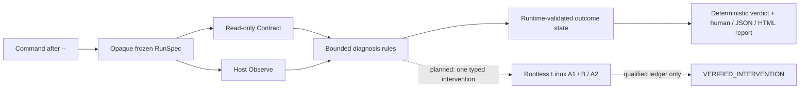

<div align="center">

# RunParity

**See what actually ran. Separate environment clues from causal proof.**

[](#current-vs-planned)
[](#runtime-support)
[](./LICENSE)

</div>

When a command works in CI but fails locally—or works in one terminal and not
another—an environment diff gives you suspects. RunParity records the command,
runtime, executable path, declared constraints, and bounded output that were
actually involved. It then says exactly how strong the evidence is.

RunParity does **not** call a correlation a root cause, silently repair the host,
or pretend that running a command on your machine is sandboxed.

> **Project status:** `0.0.0` is a private, pre-S0 source prototype. Host
> observation works today, and all twelve supported-positive fixtures hold
> real isolated A1/B/A2 proof chains (verified against a dedicated QEMU-KVM
> rootless-Podman backend whose eleven isolation controls were demonstrably
> qualified); public npm install instructions do not exist yet. See
> [Current vs planned](#current-vs-planned) and
> [ADR-0005](./docs/adr/0005-qualified-linux-rootless-backend-and-proof-ledger.md).

## Try the deterministic demo

You need Node.js and pnpm. From a checkout of this repository:

```console
pnpm install --frozen-lockfile
pnpm build
cd examples/node-engine-drift
node ../../dist/cli.js doctor --report-only -- node fail.mjs
```

The fixture declares `engines.node: ">=99"` and exits with code 23, so it is
offline and deterministic. An abridged current Windows run looks like this:

```text
RunParity
=========
FAIL  Command failed (exit 23)

Command    node fail.mjs
Resolved   C:\Program Files\nodejs\node.exe
Context    HOST_OBSERVATION
Verdict    PARTIAL_EVIDENCE

What we found
  Candidate  Node 24.15.0 is outside the declared range >=99
             This drift is observed; it has not been verified as the cause.
```

That last sentence is the point: the mismatch is real evidence, but no isolated
experiment has shown that changing Node alone controls the outcome.

The target exits 23; `--report-only` deliberately makes RunParity exit 0 after a
valid non-timeout report. Omit that option when you want to preserve the target
exit code.

For stable machine output, put the global `--json` option before `doctor`:

```console
node ../../dist/cli.js --json doctor --report-only -- node fail.mjs
```

For a self-contained report you can inspect or print offline, select HTML instead:

```console
node ../../dist/cli.js --html doctor --report-only -- node fail.mjs > runparity-report.html
```

`--json` and `--html` are mutually exclusive. The HTML document contains no
scripts or external assets and renders the same already-redacted report envelope;
it is still not guaranteed secret-free, so review it before sharing.

Target arguments must follow `--`. RunParity preserves them as separate argv
tokens and never sends the target through a shell by default.

## New here? When to reach for RunParity

You do not need to read any architecture document to get value. If one of these
sounds like your day, run the one command:

| Symptom | What doctor records |
| --- | --- |
| "Works in CI, fails on my laptop" | Which executable actually ran (lookup path vs canonical target), runtime identity vs `engines.node` |
| "Broke after I switched nvm/pnpm/volta" | Runtime and package-manager drift plus PATH-order candidates |
| "My teammate's install works, mine doesn't" | npm config source conflicts (`fund`, `strict-peer-deps`) with bounded excerpts |
| `npm rebuild` did not fix a `.node` error | Genuine `NODE_MODULE_VERSION` / loader signals without rebuilding anything |

Two words matter in every report:

- **PARTIAL_EVIDENCE** — "we observed this correlation." Most reports stop
  here, honestly.
- **VERIFIED_INTERVENTION** — "an isolated A1/B/A2 experiment on a qualified
  rootless backend reproduced the failure, flipped exactly one typed change,
  and the failure returned when the change was removed." The fixture corpus
  below holds twelve such proofs; the public CLI never prints this word from
  host observation alone.

RunParity never edits your PATH, lockfile, or global tools, and never calls a
correlation a root cause. Use `npx runparity doctor -- <your-command>` after
publication, or run the demo below from a checkout.

## What the prototype can inspect

- **PATH shadowing:** the requested command, the absolute path that matched, its
  canonical target, and other canonical candidates instead of trusting a single
  `which` or `where` result. Alias provenance is bounded and does not make an
  alias count look like multiple executables.
- **Runtime and package-manager drift:** active Node identity versus
  `engines.node`, plus narrowly qualified local package-manager claims.
- **Configuration conflicts:** contradictory, non-secret npm boolean sources for
  `fund` and `strict-peer-deps`. The prototype deliberately does not guess the
  effective winner.
- **Native ABI signals:** explicit `NODE_MODULE_VERSION` mismatch output, without
  downloading or rebuilding native artifacts.

Every report contains no more than three ranked findings. Findings are bounded
hypotheses, not proof.

## The evidence pipeline



The verdict seam fails closed on impossible states. For example, a result cannot
claim both “not started” and “exit 0,” and uncontained Host cleanup cannot be
upgraded to `verified`.

## Human-friendly and automation-friendly

The default report leads with the outcome, the evidence behind it, and what is
still unknown. `--json` emits one schema-versioned document to stdout so CI and
issue tooling can consume the same observation without scraping prose. `--html`
emits one responsive, printable, self-contained offline document to stdout after
a completed observation.

```json
{
  "schema": "runparity.cli/v1",
  "ok": true,
  "command": "doctor",
  "data": {
    "report": {
      "verdict": "PARTIAL_EVIDENCE",
      "execution_context": "HOST_OBSERVATION",
      "experiment_progress": "OBSERVED"
    }
  },
  "error": null
}
```

`ok` means RunParity completed the observation operation. It does not mean the
target command passed. Target exit data and captured stdout/stderr live under
`data.report.observation.result`.

## Why this project exists

The design is grounded in a targeted audit of 72 direct GitHub issue or
discussion pages from 72 distinct repositories: 18 cases in each of four
failure families. Examples include a child process observing a different pnpm
than the top-level shell ([pnpm/pnpm#7124](https://github.com/pnpm/pnpm/issues/7124)),
a cache restoring an older requested runtime
([oven-sh/setup-bun#146](https://github.com/oven-sh/setup-bun/issues/146)),
environment and `.env` precedence changing across versions
([docker/compose#9737](https://github.com/docker/compose/issues/9737)), and an
ARM64-labelled path containing an x86-64 ELF artifact
([microsoft/node-pty#860](https://github.com/microsoft/node-pty/issues/860)).

This was a quota-based engineering audit, not a random prevalence or search
volume study. It supports the problem taxonomy and safety boundaries; it does
not forecast stars or downloads. The full methodology, links, dispositions, and
bias analysis are in [Demand evidence](./docs/DEMAND-EVIDENCE.md).

## Current vs planned

| Capability | `0.0.0` source prototype | Target V1 |
| --- | --- | --- |
| Host command observation | Available | Hardened and release-qualified |
| Human, stable JSON, and self-contained HTML reports | Available | Add Markdown, SARIF, saved-report import/export, and release qualification |
| Node/manager/PATH/native bounded findings | Narrow current rules | Four families, each with 3/3 fixtures verified in isolation |
| Automatic host repair | Intentionally absent | Intentionally absent |
| Host outcome policy | Internal runtime classifier → discriminated state → pure deterministic decision; contradictory states and `verified` Host cleanup fail closed | Public contract and release qualification remain required |
| Experiment planning | Internal opaque, pure plan-only compiler for an exact A1/B/A2 `path.prepend` spec; it requires complete fixed-input/base/qualification/oracle digests, unique arm freshness, and an absolute directory matching the base PATH style | Preview one typed intervention |
| Backend qualification | Available (maintainer side): a supervised SSH transport and an eleven-control probe battery demonstrably qualify a dedicated QEMU-KVM Ubuntu VM running rootless Podman under a non-root account | Same battery against additional native Linux backends |
| Isolated A1/B/A2 proof | All 12 supported positives verified: each holds a three-sequence ledger (single-token typed intervention across four delta kinds) whose signatures, oracle, and intervention diffs are re-derived independently by the validator before `verified` is accepted | Sealed S1 benchmark |
| Windows/macOS | Host Observe only | Host Observe only for V1 |
| Public `npx runparity` | Not published | Planned after release gates pass |

The [product requirements](./docs/PRD.md) define the target. The
[CLI contract](./docs/CLI.md) is the precise source of truth for behavior that is
already executable.

The internal compiler is deliberately not a public preview: its opaque token and
safe inspection summary do not expose command, PATH, or intervention-directory
values, and it neither runs arms nor produces a proof ledger.

## Safety and privacy boundary

`doctor` runs the command you supplied on the host with your normal permissions.
It is **not a sandbox**. The command may read files, use credentials, access the
network, spawn children, or make changes just as it would without RunParity.

The prototype bounds captured excerpts, applies defense-in-depth redaction and
display-control hardening, and uses invocation-scoped HMACs for stream digests.
These controls do not guarantee a report is secret-free. Review reports before
sharing them.

On timeout, RunParity attempts best-effort POSIX process-group or Windows
process-tree cleanup. The attempt is recorded as `best_effort` or `failed`, but
either result remains an `uncontained_host`. A detached descendant can survive,
so an execution timeout returns `ABORTED_SAFETY` rather than claiming successful
containment. Read the complete [security model](./docs/SECURITY-MODEL.md) before
running untrusted commands.

## Development

```console
pnpm install --frozen-lockfile
pnpm verify
```

`pnpm verify` runs formatting/lint checks, TypeScript, product tests, fixture
manifest validation and its adversarial tests, then builds the distributable
CLI.

The open fixture corpus contains 16 versioned **implemented** manifests: 12
proof-eligible target assets (three for each V1 diagnosis family), two hard
negatives, and two out-of-scope environment cases. For every implemented case,
the validator recomputes a bounded non-empty asset inventory, checks a contained
Node entrypoint without executing it, binds that entrypoint to the manifest's
planned argv, and binds asset and manifest digests to the build receipt.
The runtime and native fixtures also have bounded platform-gated Host smoke
tests. For native artifacts, these separately inspect the relevant ELF
ABI/architecture/dynamic-library facts, observe real loading behavior, and test
the content-addressed matching selection; they are not isolated A/B/A2 arms.
`runnable=true` means only that the static target invocation is complete; null
backend and ledger receipts record the missing proof infrastructure. All live
source trees remain explicitly unqualified. Hash-linked “verification” ledgers
are still rejected: arm, oracle, safety, cleanup, and isolation evidence must be
independently recomputed before `verified`. See the
[validation protocol](./docs/VALIDATION.md) for the exact current boundaries.

`DEV-PATH-001` contains two fixed POSIX launchers that forward to the same
externally supplied absolute Node executable and differ only in their fixture
marker. Its Linux-only smoke test applies the same executable mode to temporary
copies and exercises both PATH orders. Build receipt v1 binds file paths and
bytes, not POSIX mode, and this Host smoke is not an isolated experiment.
`DEV-PATH-003` adds an inventoried two-hop link recipe and two regular launchers.
Its Linux-only Host smoke materializes the links in a temporary workspace and
checks the matched link path and final canonical target path before and after
execution. That is provenance smoke evidence, not file/content identity,
backend containment, or an isolated Intervention.
See the [validation protocol](./docs/VALIDATION.md).

### Runtime support

The built controller has smoke evidence on Node 18.20.8, 20.19.5, 22.22.0, and
24.15.0. Node 18 and 20 are EOL compatibility lines. Development and future
release qualification target maintained Node 22 and 24.

## Contributing

High-value contributions are reproducible environment failures, redaction and
process-safety adversarial tests, platform resolver parity cases, fixture assets,
and report usability feedback. Before opening a change, read:

- [Domain language and invariants](./CONTEXT.md)
- [Product requirements](./docs/PRD.md)
- [Security model](./docs/SECURITY-MODEL.md)
- [Validation protocol](./docs/VALIDATION.md)

Please do not weaken a gold fixture label to make an implementation pass. A label
change needs evidence and an explicit protocol amendment.

## License

[MIT](./LICENSE)
